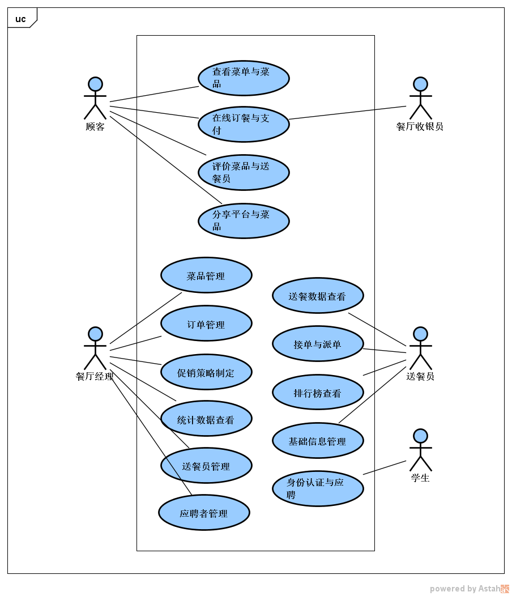

# 汉风堂外卖系统

---
用例文档

V1.0

更新记录

|时间|更新负责人|更新内容|版本号|
|---|---|---|---|
|2018-10-16|恽叶霄|初步制定系统需要处理的场景、用例|V0.1|
|2018-10-23|恽叶霄|经过这一阶段的两次面谈的结果初步完成用例文档|V1.0|
|2018-10-24|恽叶霄|优化文档排版|V1.1|

---

## 1. 引言

### 1.1 目的
该文档详细记录了汉风堂外卖订餐系统所涉及到的场景用例以此为
基础的用户需求。

### 1.2 阅读说明
用例描述的约定为必须要包含用例 ID、名称、创建日期、最后一次
更新日期、参与者、触发条件、前置条件、后置条件、优先级、正
常流程、扩展流程特殊需求。其中流程要完整有序地描述该用例中
使用者与系统的交互。

### 1.3 参考文献
《就诊信息一体化系统——用例文档V1.0》

《需求工程——软件建模与分析（第二版）》

## 2. 客户提出的问题
南京大学仙林校区汉风堂休闲餐厅在学校品牌形象良好，菜品深受
同学欢迎，但由于场地大小有限，开业时间时经常无法容纳下全部
的顾客。汉风堂希望做一些外卖方面的尝试，但是由于营业环境在
学校，周围没有更多的商家，因此无法将送餐服务转给大型外卖平
台，于是决定开发出一套属于自己的订餐系统，但是其中存在一些
列问题需要解决：

1. 店内希望能雇佣到靠谱可信赖的送餐员工。

2. 希望所有员工（包括送餐员）可以尽快上手该系统，同时系统有
其他提高所有员工（包括送餐员）工作效率的机制。

3. 店内菜品过多，商家希望秉承优胜劣汰的原则，不断更新总菜单。

4. 希望能够进一步提高店内订单的数量，吸引更多的消费者。

## 3. 用例列表
|参与者|用例编号|用例名称|
|---|---|---|
|餐厅顾客|1|查看菜单与菜品|
||2|在线订餐与支付|
||3|评价菜品与送餐员|
||4|分享平台与菜品|
|餐厅经理|5|菜品管理|
||6|订单管理|
||7|促销策略制定|
||8|统计数据查看|
||9|送餐员管理|
||10|应聘者管理|
|餐厅收银员|2|在线订餐与支付|
|送餐员|11|接单与派单|
||12|送餐数据查看|
||13|排行榜查看|
||14|基础信息管理|
|学生|15|身份认证与应聘|

## 4. 用例图

## 5. 详细用例描述
|ID|1|
|---|---|
|名称|查看菜单与菜品|
|创建者|郝睿|
|创建日期|2018-10-16|
|最后一次更新者|恽叶霄|
|最后更新日期|2018-10-23|
|参与者|顾客|
|触发条件|顾客想要点餐|
|前置条件|用户在系统首页选择进入点餐页面|
|后置条件|无|
|优先级|高|
|正常流程|1.0 查看菜单|
||&ensp;1. 顾客打开订餐系统|
||&ensp;2. 系统显示菜单|
||1.1 查看排行榜|
||&ensp;1. 顾客查看菜品销量排行|
||&ensp;2. 系统显示当前销量排名前十的菜品|
||1.2 查看菜品|
||&ensp;1. 顾客查看某一具体菜品|
||&ensp;2. 系统显示该菜品的详细信息，包括图片、价格、|
||&ensp;文字介绍、销量和好评率|
||1.3 搜索菜品|
||&ensp;1. 顾客输入关键字搜索菜品|
||&ensp;2. 系统显示相关菜品|
|扩展流程|1.0-1a. 顾客取消查看菜单|
||&ensp;1. 系统返回首页|
||1.1-1a. 顾客取消查看菜品销量排行|
||&ensp;1. 系统返回菜单界面|
||1.2-1a. 顾客取消查看菜品详细信息|
||&ensp;1. 系统返回菜单界面|
|特殊需求|无|

|ID|2|
|---|---|
|名称|在线订餐与支付|
|创建者|郝睿|
|创建日期|2018-10-16|
|最后一次更新者|恽叶霄|
|最后更新日期|2018-10-23|
|参与者|顾客，收银员|
|触发条件|顾客决定了要点的菜品|
|前置条件|顾客已登录且已经进入菜单页面/顾客已经进入具体菜品信息页面|
|后置条件|系统更新销量信息，收银员通知备菜|
|优先级|高|
|正常流程|1. 顾客选择要订购的菜品和数量|
||2. 系统更新已选菜品信息|
||3. 重复1，2两步|
||4. 顾客结算账单|
||2. 系统提示顾客选择收货地址|
||3. 顾客填写收货地址|
||4. 系统提示顾客选择支付方式|
||5. 顾客选择支付方式|
||6. 系统提示顾客输入支付密码|
||7. 顾客输入密码并完成支付|
||8. 系统通知收银员接单|
||9. 收银员接单|
||10. 系统更新订单状态为正在备菜|
|扩展流程|1a. 顾客取消挑选某一菜品|
||&ensp;1. 系统更新已选菜品信息|
||6a. 顾客取消支付|
||&ensp;1. 系统返回菜单界面，保留已选菜品信息|
||6b. 顾客更改支付方式|
||&ensp;1. 系统提示顾客选择支付方式|
||7a. 顾客输入密码错误|
||&ensp;1. 系统提示顾客重新输入密码|
|特殊需求|密码输入错误三次后，一小时内禁止该顾客尝试购买|

|ID|3|
|---|---|
|名称|评价菜品和送餐员|
|创建者|恽叶霄|
|创建日期|2018-10-23|
|最后一次更新者|恽叶霄|
|最后更新日期|2018-10-23|
|参与者|顾客|
|触发条件|顾客想要评价某次所点的菜品和送餐员|
|前置条件|顾客订单已送达|
|后置条件|系统更新相关菜品数据和送餐员数据|
|优先级|中|
|正常流程|1.0 评价菜品|
||&ensp;1. 用户给订单中一些或全部菜品进行评分，附加文字和图片评价|
||&ensp;2. 系统显示评价提交成功|
||1.1 评价送餐员|
||&ensp;1. 用户给本次订单的送餐员进行评分，附加文字说明|
||&ensp;2. 系统显示评价提交成功|
|扩展流程|1.0-1a,1.1-1a 用户取消本次评价|
||&ensp;1. 系统退回订单列表，不做变化|
|特殊需求|评分总分为5星，图片最多添加6张|

|ID|4|
|---|---|
|名称|分享平台与菜品|
|创建者|恽叶霄|
|创建日期|2018-10-15|
|最后一次更新者|恽叶霄|
|最后更新日期|2018-10-23|
|参与者|顾客|
|触发条件|顾客想要分享这个平台或某道菜品|
|前置条件|顾客已登录|
|后置条件|无|
|优先级|低|
|正常流程|1. 用户选择分享平台或某道菜品|
||2. 系统提供分享链接和相关图片|
||3. 用户选择社交平台|
||4. 系统自动生成默认标语|
||5. 用户发布分享消息|
|扩展流程|3a,5a. 用户取消分享|
||&ensp;1. 系统回到原页面|
|特殊需求|无|

|ID|5|
|---|---|
|名称|菜品管理|
|创建者|钱美缘|
|创建日期|2018-10-16|
|最后一次更新者|恽叶霄|
|最后更新日期|2018-10-23|
|参与者|经理|
|触发条件|经理想要手动修改餐厅菜单|
|前置条件|经理已登录系统|
|后置条件|存储修改后的数据|
|优先级|高|
|正常流程|1.0 菜单查看|
||&ensp;1. 经理查看现在系统中的菜单|
||&ensp;2. 系统展示当前系统中使用的菜单，包括菜品描述、|
||&ensp;菜品图片、顾客评分、销量、销售额。|
||1.1 添加新菜品|
||&ensp;1. 经理输入菜品的名称、图片、文字介绍|
||&ensp;2. 系统添加菜品的数据|
||1.2 删除菜品|
||&ensp;1. 经理选择删除部分菜品|
||&ensp;2. 系统显示选中菜品的详细信息并请求经理确认|
||&ensp;3. 经理确认删除|
||&ensp;4. 系统删除相关菜品数据|
||1.3 修改菜品|
||&ensp;1. 经理选择需要修改的菜品|
||&ensp;2. 系统显示菜品的详细信息并等待经理修改|
||&ensp;3. 经理完成修改并确认|
||&ensp;4. 系统保存修改后的数据|
|扩展流程|1.1-1a. 经理取消添加|
||&ensp;1. 系统无操作|
||1.2-3a. 经理取消操作|
||&ensp;1. 系统无操作|
||1.3-3a. 经理取消操作|
||&ensp;1. 系统无操作|
|特殊需求|经理可以根据数据对菜品列表进行排序|

|ID|6|
|---|---|
|名称|订单管理|
|创建者|恽叶霄|
|创建日期|2018-10-23|
|最后一次更新者|恽叶霄|
|最后更新日期|2018-10-23|
|参与者|经理|
|触发条件|经理想要查看订单|
|前置条件|经理已登录系统|
|后置条件|无|
|优先级|中|
|正常流程|1. 经理选择查看订单|
||2. 系统显示当天所有订单的详细信息和当天的总销售额和销售量|
||3. 经理输入时间段进行筛选|
||4. 系统筛选相应订单并显示详细信息，包括总销售额和销量|
||5. 经理选择部分订单或全部订单导出|
||6. 系统导出每张订单的数据为表格|
|扩展流程|5a. 经理取消导出|
||&ensp;1. 系统无操作|
|特殊需求|无|

|ID|7|
|---|---|
|名称|促销策略制定|
|创建者|恽叶霄|
|创建日期|2018-10-23|
|最后一次更新者|恽叶霄|
|最后更新日期|2018-10-23|
|参与者|经理|
|触发条件|经理想要制定促销策略|
|前置条件|经理已登录系统|
|后置条件|系统更新相关数据|
|优先级|低|
|正常流程|1.0 查看促销策略|
||&ensp;1. 经理进入促销策略制定系统|
||&ensp;2. 系统显示当前的所有促销策略|
||1.1 制定满减策略|
||&ensp;1. 经理输入满减策略的基础消费额和优惠额度|
||&ensp;2. 系统显示该策略的详细信息并请求经理确认|
||&ensp;3. 经理确认|
||&ensp;4. 系统添加该策略|
||1.2 删除满减策略|
||&ensp;1. 经理选中某一满减策略并删除|
||&ensp;2. 系统显示该满减策略的详细信息并请求经理确认|
||&ensp;3. 经理确认|
||&ensp;4. 系统删除该策略|
||1.3 制定特价菜|
||&ensp;1. 经理开始选择优惠菜品|
||&ensp;2. 系统显示当前所有的菜品列表|
||&ensp;3. 经理选择某一个菜品，并输入优惠后的单价|
||&ensp;4. 经理重复步骤3，直至没有需要优惠的菜品|
||&ensp;5. 系统列出当前所有优惠菜品的详细信息并请求经理确认|
||&ensp;6. 经理确认|
||&ensp;7. 系统更新优惠菜品列表|
||1.4 删除特价菜|
||&ensp;1. 经理选中部分特价菜并删除|
||&ensp;2. 系统显示选中菜品详细信息并请求经理确认|
||&ensp;3. 经理确认|
||&ensp;4. 系统删除该优惠菜品并更新优惠菜品列表|
|扩展流程|1.1-2a,1.2-2a,1.3-5a,1.4-2a 经理取消|
||&ensp;1. 系统不更新数据|
|特殊需求|无|

|ID|8|
|---|---|
|名称|统计数据查看|
|创建者|恽叶霄|
|创建日期|2018-10-23|
|最后一次更新者|恽叶霄|
|最后更新日期|2018-10-23|
|参与者|经理|
|触发条件|经理想要查看销售数据|
|前置条件|经理已登录系统|
|后置条件|无|
|优先级|中|
|正常流程|1. 经理开始查看统计数据|
||2. 系统显示月订单数和菜品的月总销量和销售额，同时展示|
||最近3个月的动态变化图表|
||3. 经理输入日期段筛选|
||4. 系统显示相应的日期段内的上述数据的动态图表|
|扩展流程|无|
|特殊需求|无|

|ID|9|
|---|---|
|名称|送餐员管理|
|创建者|恽叶霄|
|创建日期|2018-10-15|
|最后一次更新者|恽叶霄|
|最后更新日期|2018-10-23|
|参与者|经理|
|触发条件|经理想要管理送餐员或新送餐员加入或送餐员离职|
|前置条件|经理已登录系统|
|后置条件|系统更新送餐员数据|
|优先级|中|
|正常流程|1.0 查看送餐员列表|
||&ensp;1. 经理进入送餐员管理平台|
||&ensp;2. 系统显示所有送餐员的信息、业绩、排名和当前应付工资|
||1.1 添加送餐员|
||&ensp;1. 经理输入送餐员的名称、联系电话、入职时间、住址|
||&ensp;2. 系统请求经理确认|
||&ensp;3. 经理确认|
||&ensp;2. 系统自动生成该送餐员的编号，并添加该送餐员数据|
||1.2 删除送餐员|
||&ensp;1. 经理选择解雇部分送餐员|
||&ensp;2. 系统显示选中送餐员的详细信息并请求经理确认|
||&ensp;3. 经理确认|
||&ensp;4. 系统删除相关送餐员数据并通知相关送餐员用户|
||1.3 查询送餐员|
||&ensp;1. 系统显示所有送餐员的列表|
||&ensp;2. 经理输入编号或名称|
||&ensp;3. 系统显示对应的送餐员数据、业绩、排名和当前应付工资|
|扩展流程|1.1-2a,1.2-2a 经理取消|
||&ensp;1. 系统不更新数据|
|特殊需求|无|

|ID|10|
|---|---|
|名称|应聘者管理|
|创建者|恽叶霄|
|创建日期|2018-10-24|
|最后一次更新者|恽叶霄|
|最后更新日期|2018-10-24|
|参与者|经理|
|触发条件|有新的应聘者信息未被经理处理|
|前置条件|经理已登录系统|
|后置条件|系统更新相关应聘者信息和送餐员信息|
|优先级|中|
|正常流程|1.0 查看新应聘者|
||&ensp;1. 经理进入应聘者管理系统|
||&ensp;2. 系统显示所有未被处理的应聘者的详细信息，|
||&ensp;包括学号、姓名、电话、住址和面部照片|
||1.1 通过应聘者|
||&ensp;1. 经理选中部分应聘者并通过|
||&ensp;2. 系统显示选中应聘者的详细信息并请求经理确认|
||&ensp;3. 经理确认|
||&ensp;4. 系统自动生成编号和入职时间并将其加入送餐员|
||1.2 忽略应聘者|
||&ensp;1. 经理选中部分应聘者并忽略|
||&ensp;2. 系统显示选中应聘者的详细信息并请求经理确认|
||&ensp;3. 经理确认|
||&ensp;4. 系统删除相关应聘信息|
|扩展流程|1.1-2a,1.2-2a 经理取消|
||&ensp;1. 系统不修改数据，重新显示应聘者列表|
|特殊需求|无|

|ID|11|
|---|---|
|名称|接单与派单|
|创建者|恽叶霄|
|创建日期|2018-10-23|
|最后一次更新者|恽叶霄|
|最后更新日期|2018-10-23|
|参与者|送餐员|
|触发条件|系统产生了新订单|
|前置条件|送餐员已登录系统|
|后置条件|系统更新相关订单的信息和送餐员数据|
|优先级|高|
|正常流程|1. 送餐员刷新订单列表|
||2. 系统实时更新当前无人接单的订单列表|
||3. 送餐员选中部分订单接单|
||4. 系统更新相关订单的送餐员数据，更新订单状态为已接单，|
||更新最新订单列表，并显示当前已接订单|
||5. 送餐员到店取餐打卡|
||6. 系统更新订单状态为开始派送|
||7. 送餐员派送完毕打卡|
||8. 系统更新订单状态为已送达|
|扩展流程|无|
|特殊需求|无|

|ID|12|
|---|---|
|名称|送餐数据查看|
|创建者|恽叶霄|
|创建日期|2018-10-15|
|最后一次更新者|恽叶霄|
|最后更新日期|2018-10-23|
|参与者|送餐员|
|触发条件|送餐员想要查询自己的送餐数据|
|前置条件|送餐员已登录系统|
|后置条件|无|
|优先级|中|
|正常流程|1. 系统显示送餐员当月的业绩、收获评分和可得收入|
||2. 送餐员输入日期区间|
||3. 系统展示该送餐员在特定日期范围内的送餐记录，包括|
||日期、订单号、顾客、送餐时长、顾客评价|
|扩展流程|无|
|特殊需求|无|

|ID|13|
|---|---|
|名称|排行榜查看|
|创建者|恽叶霄|
|创建日期|2018-10-15|
|最后一次更新者|恽叶霄|
|最后更新日期|2018-10-23|
|参与者|送餐员|
|触发条件|送餐员查询自己的排行|
|前置条件|送餐员已登录|
|后置条件|无|
|优先级|中|
|正常流程|1. 送餐员查询自己的排行|
||2. 系统显示当前送餐员的排行并列出当前的送餐员排行榜|
|扩展流程|无|
|特殊需求|无|

|ID|14|
|---|---|
|名称|基础信息管理|
|创建者|恽叶霄|
|创建日期|2018-10-23|
|最后一次更新者|恽叶霄|
|最后更新日期|2018-10-23|
|参与者|送餐员|
|触发条件|送餐员想要查看并编辑自己的基础数据|
|前置条件|送餐员已登录平台|
|后置条件|系统更新该送餐员信息|
|优先级|中|
|正常流程|1. 送餐员查看自己的基础信息|
||2. 系统显示送餐员的基础信息|
||3. 送餐员修改自己的联系电话和住址并提交|
||4. 系统修改相关信息|
|扩展流程|3a. 送餐员取消修改|
||&ensp;1. 系统不更新数据|
|特殊需求|无|

|ID|15|
|---|---|
|名称|身份认证与应聘|
|创建者|恽叶霄|
|创建日期|2018-10-24|
|最后一次更新者|恽叶霄|
|最后更新日期|2018-10-24|
|参与者|学生|
|触发条件|学生想要应聘送餐员职位|
|前置条件|学生已登录系统|
|后置条件|系统将学生应聘信息发送给经理|
|优先级|中|
|正常流程|1. 学生输入自己的真实姓名、学号、联系电话、住址|
||2. 系统联系校方系统核实相关学生的信息|
||3. 学生自拍一张面部照片并上传|
||4. 系统与校方系统核实该面部图片，同时展示该学生所有信息，|
||请求学生确认|
||5. 学生确认|
||6. 系统存储该学生信息|
|扩展流程|1a,3a,5a 学生取消|
||&ensp;1. 系统不保存信息并退出|
|特殊需求|无|

## 6. 用户需求列表
BR1:使用系统1个月后，一天的实际顾客数提高20%

BR2: 使用系统3个月后，订单数量提高10%

BR3: 使用系统3个月后，能够招到能力达到一般企业送餐员
订单数40%的学生送餐员

BR4: 使用系统3个月之后，学生送餐员的订单数并没有明显下降

BR5: 使用系统可以达到线上订餐功能

BR6: 使用系统后可以很明确找到高销量菜品

BR7：使总经理、接单员能够在1天之内上手平台，顾客、
送餐员能够在半小时内大概了解平台所有操作

UR1: 顾客可以通过系统查看菜单和菜品详细信息

UR2: 顾客可以通过系统在线订餐和支付

UR3: 顾客可以通过系统评价菜品和送餐员

UR4: 顾客可以通过系统向其他社交平台分享该平台和菜品

UR5: 经理可以通过系统管理菜单和菜品

UR6: 经理可以通过系统管理订单

UR7: 经理可以通过系统制定促销策略

UR8: 经理可以通过系统查看统计信息

UR9: 经理可以通过系统管理送餐员

UR10: 经理可以通过系统管理应聘者

UR11: 收银员可以通过系统获取最新订单的信息

UR12: 送餐员可以通过系统接单和派单

UR13: 送餐员可以通过系统查看自己的派单数据

UR14: 送餐员可以通过系统查看自己的排行和总排行榜

UR15: 送餐员可以通过系统修改自己的基础信息

UR16: 学生可以通过系统应聘送餐员

## 7. 跟踪矩阵

### 7.1 需求原始信息
|需求编号|需求类别|需求来源|
|---|---|---|
|BR1|业务需求|客户|
|BR2|业务需求|客户|
|BR3|业务需求|客户|
|BR4|业务需求|客户|
|BR5|业务需求|客户|
|BR6|业务需求|客户|
|BR7|业务需求|客户|
|UR1|用户需求|市场|
|UR2|用户需求|客户|
|UR3|用户需求|客户|
|UR4|用户需求|客户|
|UR5|用户需求|客户|
|UR6|用户需求|市场|
|UR7|用户需求|客户|
|UR8|用户需求|市场|
|UR9|用户需求|市场|
|UR10|用户需求|市场|
|UR11|用户需求|市场|
|UR12|用户需求|市场|
|UR13|用户需求|市场|
|UR14|用户需求|用户|
|UR15|用户需求|市场|
|UR16|用户需求|用户|

### 7.2 需求过程信息

#### 7.2.1 需求可实现性
|需求编号|具有难度|可行性|风险|
|---|---|---|---|
|BR1|是|可|无|
|BR2|是|可|无|
|BR3|是|可|无|
|BR4|否|可|无|
|BR5|否|可|有|
|BR6|否|可|无|
|BR7|否|可|无|
|UR1|否|可|无|
|UR2|否|可|有|
|UR3|否|可|有|
|UR4|否|可|有|
|UR5|否|可|无|
|UR6|否|可|无|
|UR7|是|可|无|
|UR8|否|可|无|
|UR9|否|可|有|
|UR10|否|可|无|
|UR11|是|可|无|
|UR12|是|可|有|
|UR13|否|可|无|
|UR14|是|可|有|
|UR15|否|可|无|
|UR16|是|可|有|

#### 7.2.2 需求合理性
|需求编号|改善产品功能|改善产品性能|增加用户满意度|增加产品竞争力|
|---|---|---|---|---|
|BR1|是|否|是|是|
|BR2|是|否|是|是|
|BR3|是|否|否|是|
|BR4|是|否|否|是|
|BR5|是|否|是|是|
|BR6|是|否|是|是|
|BR7|否|否|是|是|
|UR1|是|否|是|否|
|UR2|是|否|是|否|
|UR3|是|否|是|否|
|UR4|是|否|否|否|
|UR5|是|否|是|否|
|UR6|是|否|是|否|
|UR7|是|否|否|否|
|UR8|是|否|是|是|
|UR9|是|否|是|否|
|UR10|是|否|否|是|
|UR11|是|否|是|否|
|UR12|是|否|否|否|
|UR13|是|否|是|否|
|UR14|是|否|是|是|
|UR15|是|否|否|否|
|UR16|是|否|是|否|

### 7.3 需求处理信息
|需求编号|是否实现|优先级|未实现原因|
|---|---|---|---|
|BR1|是|4||
|BR2|是|4||
|BR3|是|4||
|BR4|是|4||
|BR5|是|5||
|BR6|是|3||
|BR7|是|3||
|UR1|是|5||
|UR2|是|5||
|UR3|是|2||
|UR4|是|1||
|UR5|是|4||
|UR6|是|3||
|UR7|是|3||
|UR8|是|2||
|UR9|是|3||
|UR10|是|2||
|UR11|是|5||
|UR12|是|4||
|UR13|是|4||
|UR14|是|2||
|UR15|是|3||
|UR16|是|2||

### 7.4 变更信息
|需求编号|是否出现变更|变更基线|变更记录|
|---|---|---|---|
|BR1|否|||
|BR2|否|||
|BR3|否|||
|BR4|否|||
|BR5|否|||
|BR6|否|||
|BR7|否|||
|UR1|否|||
|UR2|否|||
|UR3|否|||
|UR4|否|||
|UR5|否|||
|UR6|否|||
|UR7|否|||
|UR8|否|||
|UR9|否|||
|UR10|否|||
|UR11|否|||
|UR12|否|||
|UR13|否|||
|UR14|否|||
|UR15|否|||
|UR16|否|||

