# 汉风堂外卖订餐系统

---

需求规格说明书
V0.1

---

## 1. 概述
该需求规格说明书详细描述了“汉风堂”外卖订餐系统1.0版本的软件功能需求
和非功能性需求。这一文档计划由实现系统功能和验证系统功能正确的项目团
队成员来使用。除非在其他地方另有说明，这里指定的所有需求都具有高优先
级，而且都需要在1.0版本中得到实现。

### 1.1 项目目的与目标
“汉风堂”外卖订餐系统旨在为南京大学仙林校区的“汉风堂”餐厅提供外卖订餐
平台和送餐员招聘和管理平台，以开展外卖服务拓宽市场，创造更多利润。通
过该系统，南京大学仙林校区的学生可以足不出户在线订购到汉风堂的菜品并
享受送货上门服务，汉风堂经理可以提高菜品、订单、送餐员和应聘者的管理
效率，汉风堂也能招到合适的高质量的送餐员，仙林校区的在住学生也可以通
过送餐来获取日常收入。

### 1.2 术语表
| 名词   | 定义/解释                              |
| ------ | -------------------------------------- |
| 顾客   | 在线订购汉风堂菜品的食客               |
| 经理   | 汉风堂餐厅的经理                       |
| 服务员 | 汉风堂餐厅的服务员                     |
| 送餐员 | 通过应聘面试并为汉风堂餐厅送外卖的学生 |
| 应聘者 | 希望通过应聘成为送餐员的学生           |
| 排行榜 | 描述了送餐员业绩的排行                 |

### 1.3 参考资料
* IEEE标准
* 《软件需求工程》

### 1.4 版本更新记录
| 时间       | 更新负责人 | 更新内容             | 版本号 |
| ---------- | ---------- | -------------------- | ------ |
| 2018-11-08 | 恽叶霄     | 制定规格说明书的框架 | V0.1   |
| 2018-11-12 | 郝睿       | 完善文档内容         | V0.2   |
| 2018-11-14 | 恽叶霄     | 最终定稿             | V1.0   |

## 2. 目标系统总体描述

### 2.1 商品前景

#### 2.1.1 应用背景
“汉风堂”是南京大学仙林校区的一家校内餐厅，经营期间菜品深受学生们的
欢迎，在校内树立了良好的品牌形象。但由于场地大小有限，进店消费人数
较多，还常常有软件学院的学生留在餐厅内写大作业占用座位，该餐厅在营
业时间内经常无法容纳下全部的顾客，顾客因为短时间内等不到位置而离开
的现象时有发生。针对这一现象，该餐厅希望做一些外卖方面的尝试。但是
由于营业环境在学校，周围没有更多的商家，因此无法将送餐服务转给大型
外卖平台。餐厅总经理决定为该餐厅添加一套属于自己的外卖订餐系统，但
是对于外卖服务的效果存在着一系列的担心，包括能否招募到送餐员工、送
餐员工的可靠性和积极性、外卖菜品的销量以及餐厅员工对于订餐系统使用
的上手难度和学习成本。老板希望新建立的外卖订餐系统能够消除他的这些
担忧，确保有一套可靠的送餐员评估和激励机制，能够留下值得信赖的送餐
员，及时处理掉不可靠的送餐员，提高送餐员的工作效率；建立菜品销量的
查看机制，方便推陈出新，及时更新被选菜单；新系统简单易上手，能够提
高“汉风堂”的销量及知名度，获得更多的好评和经济效益。  

#### 2.1.2 业务机遇
“汉风堂”餐厅配置了外卖订餐系统后，能够保证订餐客户、送餐员、接单服
务员、总经理等各方面使用起来都简单易上手，提高效率。客户可以进行方
便快捷的下单，同时可以对菜品、送餐员做出评价，对优质菜品进行社交平
台分享。送餐员可以通过系统进行招募，并有一套关于可靠性的审核评价机
制和工作激励机制。接单服务员能够清楚有条理的接到各方订单，然后将其
高效的传递给后厨出菜，接收顾客反馈的问题。餐厅总经理可以查看一定时
间内各道菜品的销量、进行菜品的撤销和添加、决定送餐员的奖惩。最终，
该外卖订餐系统能够有效提高该餐厅的经济利润，同时降低了管理成本，提
高了各角色使用人员的使用效率，推动餐厅的进一步发展。  

#### 2.1.3 业务需求
BR1:使用系统1个月后，一天的实际顾客数提高20%

BR2: 使用系统3个月后，订单数量提高10%

BR3: 使用系统3个月后，能够招到能力达到一般企业送餐员
订单数40%的学生送餐员

BR4: 使用系统3个月之后，学生送餐员的订单数并没有明显下降

BR5: 使用系统可以达到线上订餐功能

BR6: 使用系统后可以很明确找到高销量菜品

BR7：使总经理、接单员能够在1天之内上手平台，顾客、
送餐员能够在半小时内大概了解平台所有操作

### 2.2 系统结构与职责
系统由三大平台组成。首先是订餐平台，用于给顾客提供在线订餐服务和菜品
评价服务；其次是管理平台，用于为经理提供对菜单、订单、促销、应聘者和
送餐员的管理功能；最后是送餐员平台，用于为送餐员提供便捷的接单、送单
、以及各种信息查询的功能。三大平台互相联系：订餐平台产生的新订单会更
新管理平台中的诸多信息，并在送餐员平台上显示出该订单以供送餐员接单；
订餐平台中的评价会更新管理平台中的菜品信息和送餐员平台的送餐员数据；
管理平台中菜品信息的变动同样会导致订餐平台上的菜品数据的更新；送餐员
平台上产生的送餐员业绩的改动也将会更新管理平台的送餐员相关数据。

### 2.3 用户角色定义
| 角色   | 业务职责                                                 |
| ------ | -------------------------------------------------------- |
| 顾客   | 在线订餐、评价菜品和送餐员、分享平台和菜品               |
| 经理   | 菜单管理、订单管理、促销策略管理、应聘者管理、送餐员管理 |
| 服务员 | 接收订单并通报后厨制作相关菜品                           |
| 送餐员 | 接单、送单                                               |
| 应聘者 | 身份认证                                                 |

### 2.4 假设与依赖
* 现阶段汉风堂内部人员结构不变动。
* 所有涉众均熟悉并使用Android手机。
* 顾客均在南京大学仙林校区内部进行订餐。
* 学生愿意应聘送餐员以赚取生活费。
* 需要和第三方的支付平台进行集成，可以双向通信和变更。
* 需要和校方进行协作，实现身份认证。

## 3. 详细需求描述

### 3.1 对外接口

#### 3.1.1 用户界面
界面的设计原则是：方便、简洁、美观、一致。系统界面应当做到层次分明，
并且适当使用导航栏提供便捷的操作。
* 输入设备：手机屏幕、键盘、鼠标
* 输出设备：手机屏幕、显示器
* 显示风格：web图形界面
* 显示方式：根据用户使用的终端大小和屏幕大小变化而变化

##### 3.1.1.1 订餐平台相关界面
顾客可以在如下界面查看菜单：

这个菜单界面除了包含所有分类的菜品的信息和选购信息外，还包含了搜索框和部分热销
菜，便于用户快速跳转至搜索界面和排行榜界面。

下面是搜索界面：

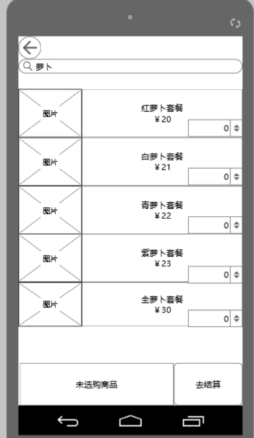

用户在搜索框中键入关键字即可发起全文搜索，系统将所有匹配的菜品按匹配度从高到低
排列。该界面同样支持直接订餐。

下面是菜品排行榜界面：

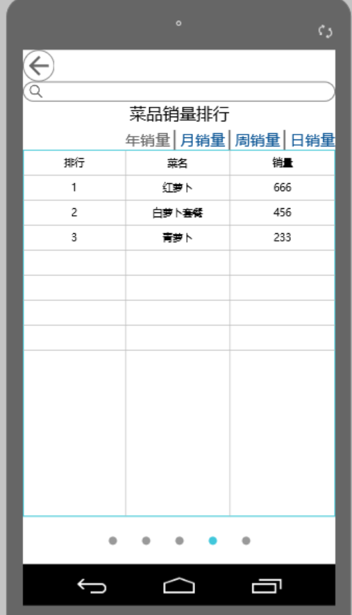

用户通过点击菜单界面的排行榜区域的“更多”按钮即可进入该界面，这里列出了各种菜品
的销量排行，并支持搜索和筛选。

下面是菜品详细信息界面：

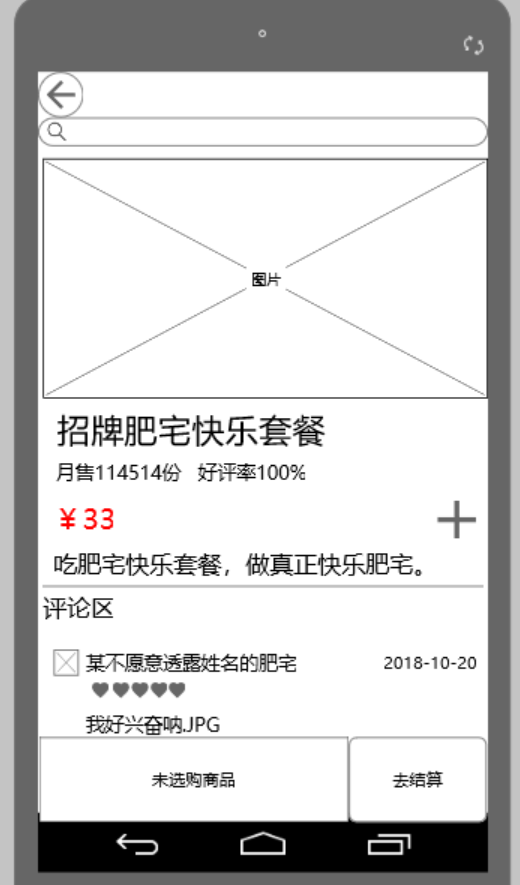

通过点击任意一个菜品即可进入该界面。界面包含了菜品的信息和用户对该菜品的评论信
息。

下面是服务员的界面：

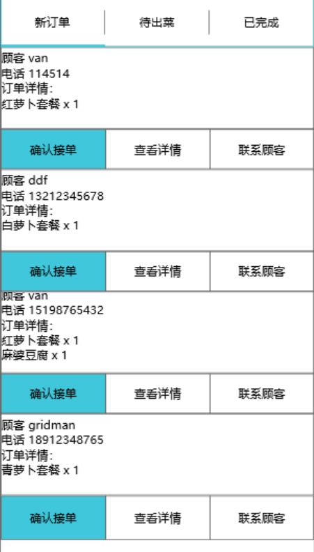

当用户下新订单后，服务员的订单列表会自动更新并通知服务员处理新订单。

下面是服务员查看订单的详细信息的界面：

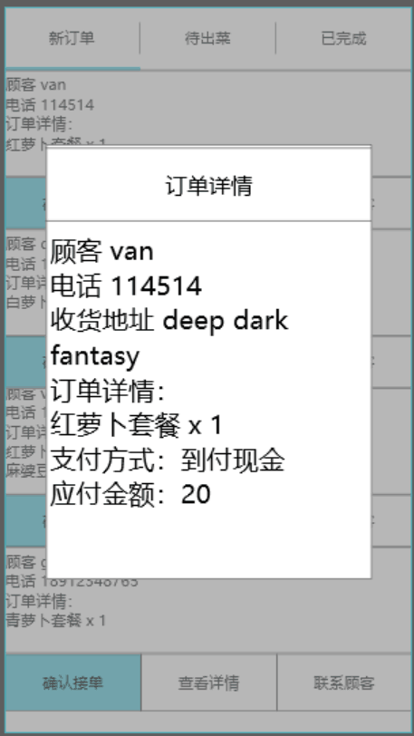

当服务员点击订单列表中一个订单的查看详情按钮后即可进入。里面包含了顾客的基本信
息和订单的详细信息。

##### 3.1.1.2 总经理平台相关界面
首先是菜品管理功能。

菜单页面如下：

总经理可以选择增加、删除、修改或者按照菜品名查询菜品，支持批量删除。例如，当总
经理点击增加按钮后：

只需要在该界面输入新菜品的基本信息即可立即新增菜品。

再例如，当总经理点击某个菜品的删除按钮时：

系统会提示，请求经理确认。

下面是订单管理界面：

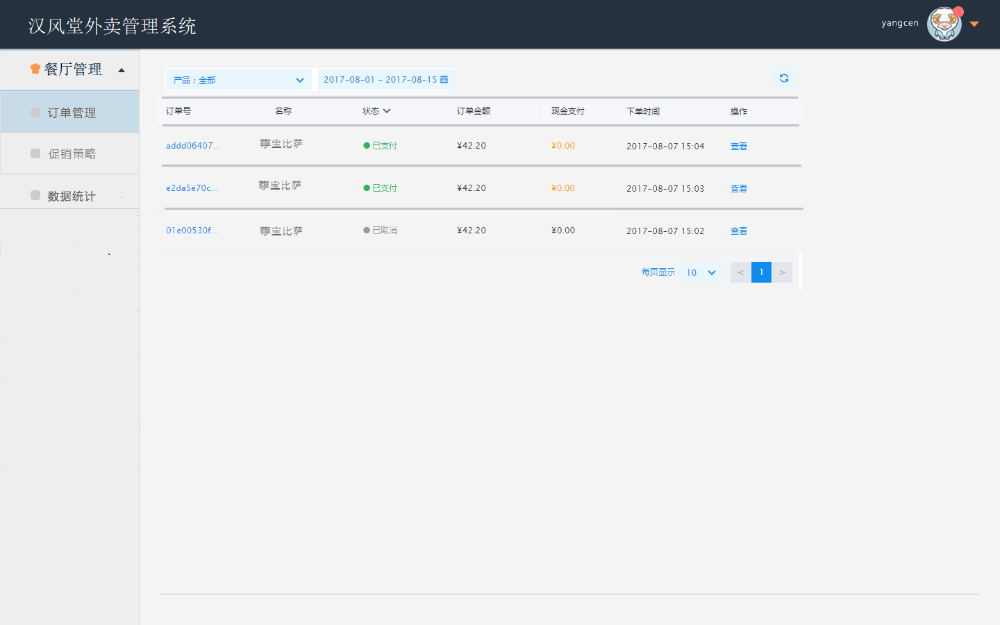

总经理可以在订单管理界面查看当前订单的详细信息；也支持搜索一定时间范围内的订单
列表，默认查看本日产生的订单；支持按订单内容进行筛选。总经理可以将订单导出为
Excel表格。

下面是促销策略管理界面：

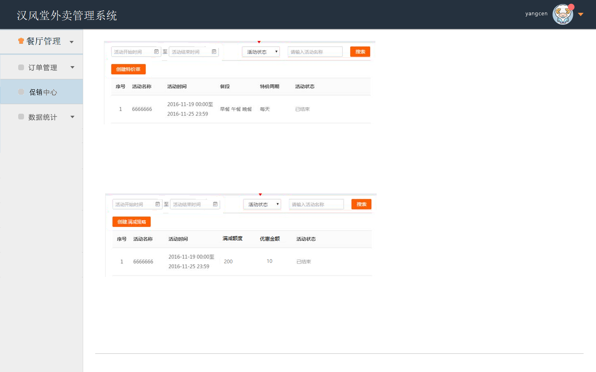

总经理可以在该界面查看、新增、修改、删除自己制定的满减策略和特价菜。支持搜索和
按菜品、时间筛选。

下面是统计数据页面：

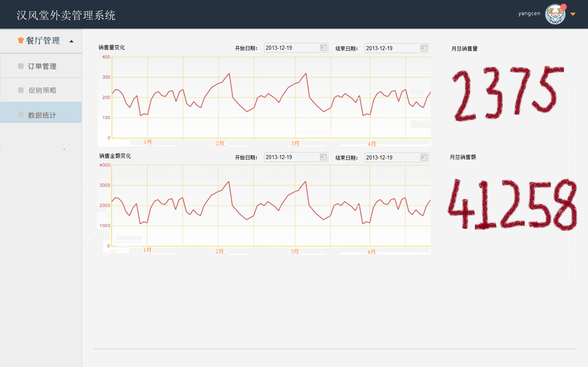

总经理可以在该页面查看订单、菜品、销量、顾客、销售额等诸多方面的统计数据。支持
按时间筛选。

下面是送餐员管理界面：

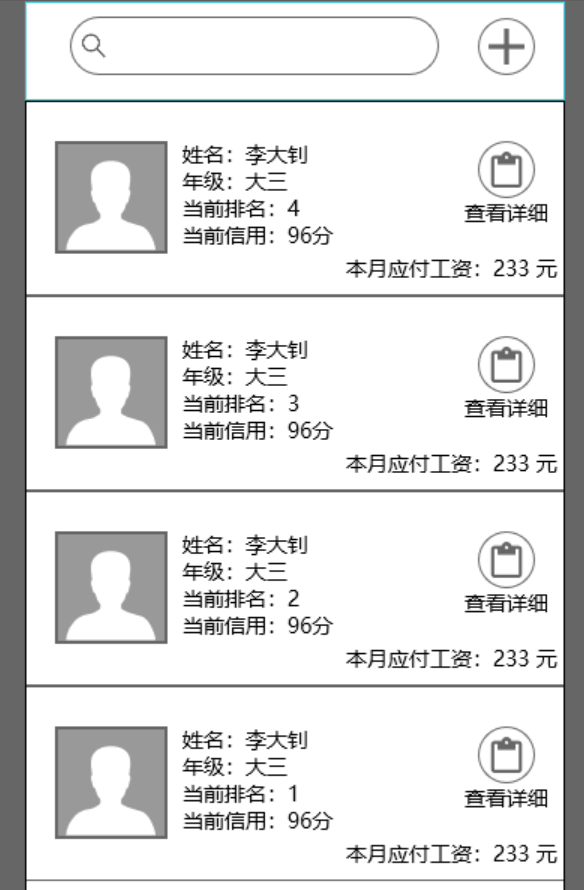

总经理可以在该页面查看所有送餐员的基本信息、排名信息、信用信息和本月应付的工资
。支持按关键字搜索。

下面是送餐员详细信息界面：

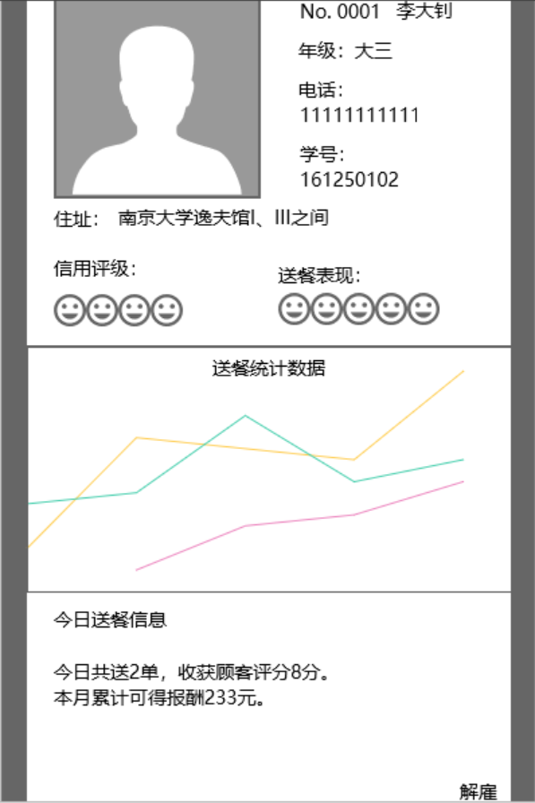

总经理可以在该界面查看某一送餐员的详细信息，包括送餐数据、业绩等。

下面是应聘者管理界面：

总经理可以在该界面查看所有应聘者的基础信息和信用审核信息。支持按学分和评分排序
。

下面是应聘者详细信息界面：

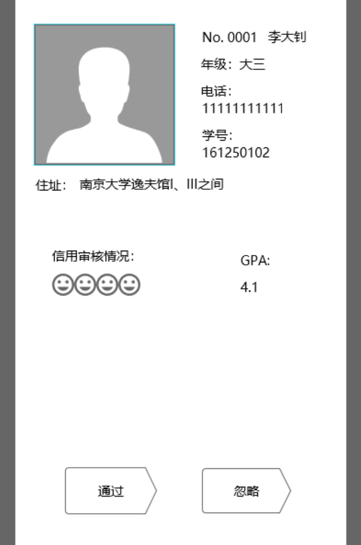

总经理可以在该界面查看某一应聘者的详细信息并对其进行通过或忽略操作。

##### 3.1.1.3 送餐员平台
下面是送餐员的接单界面：

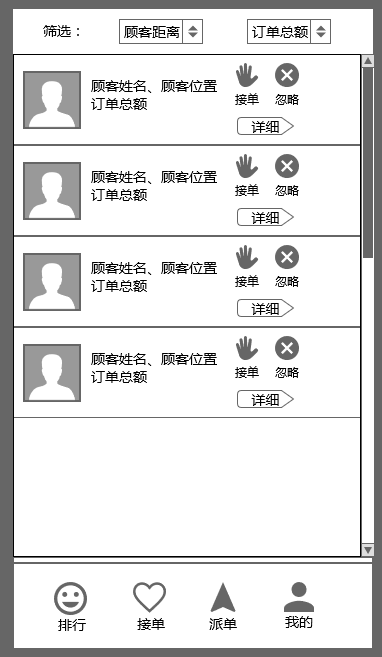

送餐员可以在该界面查看所有当前最新的无人接的订单并进行抢单。可以快速接单，支持
按顾客距离和订单总额进行筛选。送餐员也可以选择忽略某一订单。

下面是订单详细信息界面：

送餐员可以在该界面查看该订单的详细信息，包括顾客的信息和对送餐时间的要求。

下面是送餐员的派单界面：

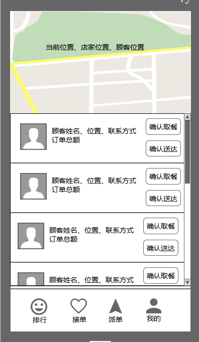

送餐员接单后可以进入该界面查看自己接的订单。送餐员可以查看地图来确认方位，同时
可以通过点击确认取餐和确认送达两个按钮来更新订单派送状态。

下面是送餐员基础信息界面：

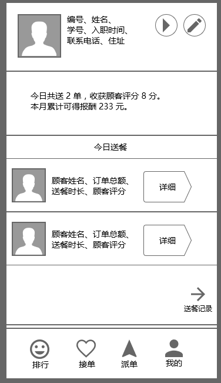

送餐员可以在该界面查看自己的基础信息。同时可以查看自己当天的业绩和当天的送餐记
录。也可以通过该界面进入送餐记录搜索界面查询自己的历史送餐记录。

下面是已完成订单的详细信息界面：

送餐员可以查看自己派送该订单的花费的时间、收获的评分和评价、也包括订单的详细信
息。

下面是送餐员排行榜界面：

送餐员可以查看每一个送餐员的排行信息和自己的排行信息，包括综合评分、业绩等。

##### 3.1.1.4 招聘平台
首先是登录界面：

点击界面上的加入送餐员按钮即可进入预验证界面：

这里需要验证学生用户的手机号和密码，确认是否为本人操作。

接着点击下一步，进入身份信息验证界面：

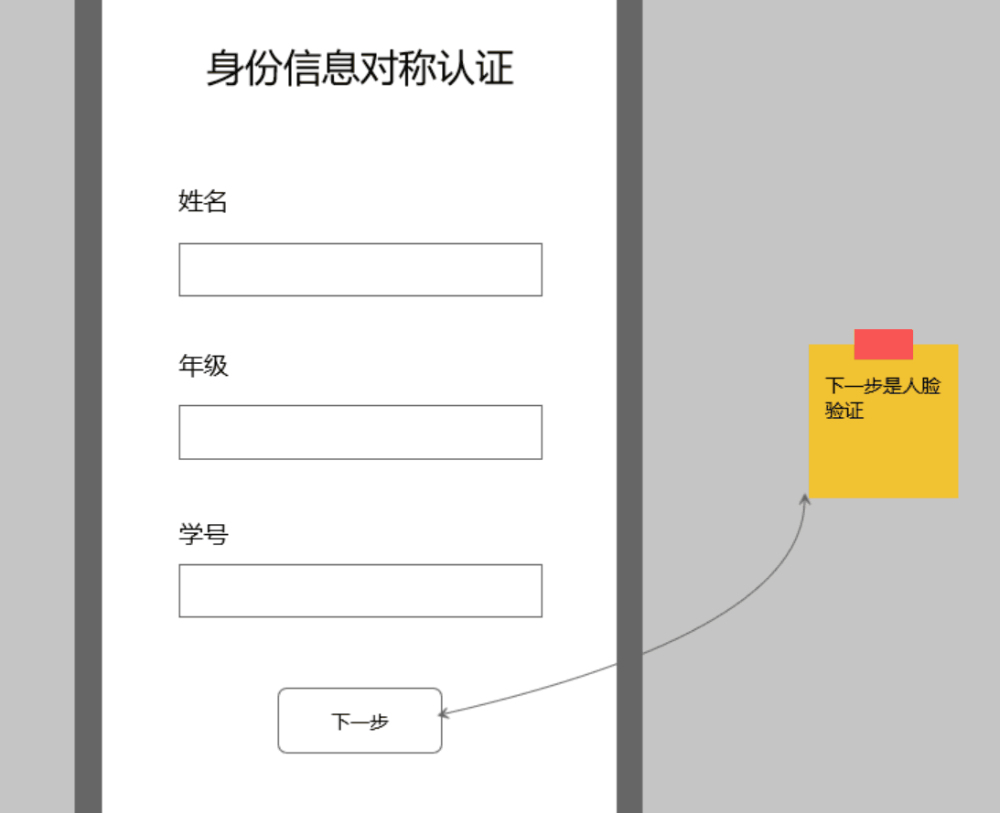

填写基本的学生信息即可，系统将通过与校方学生管理系统联系获取该学生的其他信息。
系统对学生的信息采取保密政策，绝对不会将学生个人信息泄露给任何第三方。

下面进入人脸验证界面：

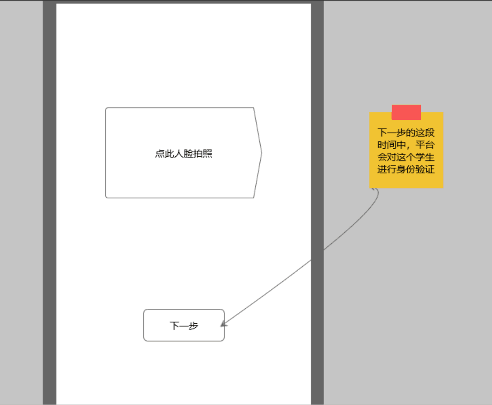

只需打开照相机功能拍一张照，与校方提供的照片进行比对即可。不支持从相册导入。

最后是完成界面：

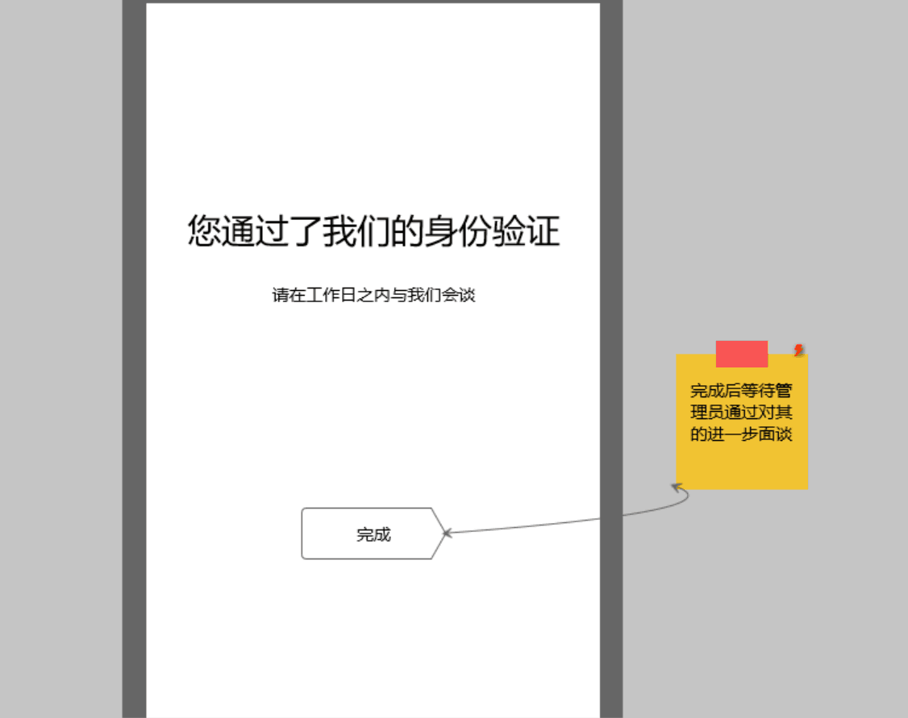

通过了所有上述验证的学生用户只需要耐心等待面试通知即可。

#### 3.1.2 软件接口
* 使用mysql作为底层数据库，存储系统数据

### 3.2 功能需求
#### 3.2.1 查看菜单与菜品

##### 刺激/响应序列
刺激：顾客请求查看菜单  
响应：系统显示最新菜单  
刺激：顾客请求查看菜品排行榜  
响应：系统显示月销量前十的菜品列表  
刺激：顾客请求搜索菜品  
响应：系统显示符合顾客输入的关键字的菜品列表  
刺激：顾客请求查看某一菜品的详细信息  
响应：系统显示该菜品的详细信息，包括菜品名称、图片、简介、单价、销售量、优惠价、销售额和顾客评分

##### 相关功能需求
| 功能需求                | 描述                                     |
| ----------------------- | ---------------------------------------- |
| DishList.view | 系统应当允许顾客查看当前的菜单 |
| DishList.showRank | 系统应当允许顾客查看菜品销量排行榜 |
| DishList.showRank.cancel | 系统应该允许顾客取消查看排行榜，返回菜单 |
| DishList.search | 系统应当允许顾客按关键词搜索菜品 |
| DishList.search.cancel | 系统应该允许顾客取消搜索，返回前一页面 |
| Dish.view | 系统应当允许顾客查看某一菜品详情 |
| Dish.view.cancel | 系统应当允许顾客取消查看菜品详情，返回前一页面 |

#### 3.2.2 在线订餐与支付

##### 刺激/响应序列
刺激：顾客选择要订购的菜品和数量  
响应：系统更新已选菜品信息，包括已选菜品，数量，结算价格  
刺激：顾客对已选菜品列表中的菜品进行更改  
响应：系统更新已选菜品信息  
刺激：顾客请求结算账单  
响应：系统提示顾客填写收货地址  
刺激：顾客填写收货地址并确认  
响应：系统提示顾客选择支付方式  
刺激：顾客选择支付方式  
响应：系统提示顾客输入支付密码  
刺激：顾客输入正确的支付密码  
响应：系统更新订单状态为正在备菜，通知收银员接单  
刺激：顾客取消支付  
响应：系统回到菜单界面，保留已选菜品信息  
刺激：顾客输入密码错误  
响应：系统提示顾客重新输入密码  
刺激：顾客单次支付输入密码错误次数达到3次  
响应：系统提示1小时内禁止该顾客尝试订餐  

##### 相关功能需求
| 功能需求                | 描述                                     |
| ----------------------- | ---------------------------------------- |
| OrderList.add | 系统应当允许顾客添加菜品订单 |
| OrderList.add.update | 系统应当允许顾客查看更新后的已选菜品信息 |
| OrderList.add.cancel | 系统应当允许顾客取消菜品订单 |
| Customer.enter | 系统应该允许顾客输入订餐必要的信息 |
| Customer.enter.address | 系统应该允许顾客输入收货地址 |
| Customer.enter.payWay | 系统应该允许顾客选择支付方式 |
| Customer.enter.password | 系统应该允许顾客输入支付密码 |
| Customer.enter.cancel | 系统应该允许顾客取消输入 |
| OrderList.update | 系统应该能够更新订单状态 |

#### 3.2.3 评价菜品和送餐员

##### 刺激/响应序列
刺激：顾客请求评价菜品  
响应：系统显示待填写的菜品评价模板，包括评分、附加文字和图片（可选）  
刺激：顾客填写菜品评价并确认  
响应：系统显示菜品评价成功  
刺激：顾客请求评价送餐员  
响应：系统显示待填写的送餐员评价模板，包括评分和附加文字说明  
刺激：顾客填写送餐员评价并确认  
响应：系统显示评价送餐员成功  
刺激：顾客填写评价过程中请求取消填写评价  
响应：系统返回订单列表界面  

##### 相关功能需求
| 功能需求                | 描述                                     |
| ----------------------- | ---------------------------------------- |
| Dish.addComment | 系统应当允许顾客评价菜品 |
| Dish.addComment.addPicture | 系统应当允许顾客给菜品评价添加图片 |
| Dish.addComment,addPicture.delete | 系统应当允许顾客删除评价图片 |
| Dish.addComment.cancel | 系统应该允许顾客取消对菜品的评价 |
| Deliverman.addComment | 系统应当允许顾客评价送餐员 |
| Deliverman.addComment.cancel | 系统应该允许顾客取消对送餐员的评价 |

#### 3.2.4 分享平台与菜品

##### 刺激/响应序列
刺激：顾客选择分享平台或某道菜品  
响应：系统显示可供分享的社交平台  
刺激：顾客选择分享至的社交平台  
响应：系统自动生成默认标语和分享链接  
刺激：用户确认发布分享消息  
响应：系统提示分享成功  
刺激：用户请求取消分享  
响应：系统返回分享任务前的页面  

##### 相关功能需求 
| 功能需求                | 描述                                     |
| ----------------------- | ---------------------------------------- |
| Dish.share | 系统应当允许顾客分享菜品 |
| Dish.share.createTitle | 系统应当支持自动生成分享时的默认标语 |
| Dish.share.entercOmment | 系统应当允许用户填写分享感受 |
| Dish.share.cancel | 系统应该允许顾客取消菜品分享 |
| Customer.choosePlatform | 系统应当允许顾客选择要分享至的社交平台 |

#### 3.2.5 菜品管理

##### 刺激/响应序列

刺激：用户点击增加菜品  
响应：系统显示空白的菜品填写表单  
刺激：用户输入菜品的数据并提交  
响应：系统显示添加结果  
刺激：用户选中需要删除的菜品  
响应：系统显示待删除菜品的详细信息  
刺激：用户确认删除菜品  
响应：系统显示删除结果  
刺激：用户选择需要修改的菜品  
响应：系统显示待修改菜品的详细信息并等待用户修改  
刺激：用户完成修改并提交  
响应：系统显示修改结果

##### 相关功能需求

| Dishes.View        | 系统允许用户查看系统中所有菜品     |
| ------------------ | ---------------------------------- |
| Dishes.View.Detail | 系统允许用户查看菜品的详细信息     |
| Dishes.Add         | 用户可以新增一个菜品               |
| Dishes.Update      | 用户可以修改菜品                   |
| Dishes.Delete      | 用户可以删除菜品                   |
| Dishes.Check       | 系统可以检查用户的表单填写是否正确 |
| Dishes.Cancel      | 系统允许用户取消菜品管理的操作     |

#### 3.2.6 订单管理

##### 刺激/响应序列

刺激：用户选择查看订单  
响应：系统显示所有订单的详细数据和统计信息  
刺激：用户输入筛选的时间段  
响应：系统显示时间段内的订单详细数据和统计信息  
刺激：用户选择订单并导出  
响应：系统将选中的订单导出为表格

##### 相关功能需求

|Bill.View|系统允许用户查看订单|
|:---|:---|
|Bill.View.Select|系统允许用户根据时间段对订单进行筛选|
|Bill.Export|系统允许用户导出订单|

#### 3.2.7 促销策略制定

##### 刺激/响应序列

刺激：用户选择制定满减策略  
响应：系统显示满减策略的制定表单  
刺激：用户填写基础消费额和优惠额度并确认  
响应：系统显示添加结果  
刺激：用户选择删除满减策略  
响应：系统显示待删除满减策略的详细信息并等待确认  
刺激：用户确认删除  
响应：系统显示满减策略的删除结果  
刺激：用户选择制定特价菜  
响应：系统显示所有的菜品列表并等待用户选择  
刺激：用户选择菜品并输入优惠后的单价  
响应：系统显示更新后的菜品列表  
刺激：用户选择部分特价菜并删除  
响应：系统显示待删除菜品的信息并请求用户确认  
刺激：用户确认删除  
响应：系统显示删除特价菜的结果

##### 相关功能需求
|Promotion.View|系统允许用户查看所有促销策略|
|:---|:---|
|Promotion.Price.Add|用户可以新增满减策略|
|Promotion.Price.Delete|用户可以删除满减策略|
|Promotion.Dishes.Select|用户可以从菜品列表中选择特价菜|
|Promotion.Dishes.Add|用户可以新增特价菜|
|Promotion.Dishes.Delete|用户删除特价菜|
|Promotion.Check|系统可以检查用户的输入|
|Promotion.Cancel|系统允许用户取消操作|

#### 3.2.8 统计数据查看

##### 刺激/响应序列

刺激：用户选择查看统计数据  
响应：系统显示统计数据和图表  
刺激：用户输入筛选的时间段  
响应：系统显示时间段统计数据和图表

##### 相关功能需求
| Statistics.View        | 系统允许用户查看统计数据               |
| ---------------------- | -------------------------------------- |
| Statistics.View.Select | 系统允许用户查看筛选时间段内的统计数据 |

#### 3.2.9 送餐员管理

##### 刺激/响应序列
刺激：经理进入送餐员管理平台  
响应：系统显示送餐员列表  
刺激：经理查询送餐员名字  
响应：系统返回包含该名字的送餐员列表  
刺激：经理查看送餐员详细信息  
响应：系统显示某送餐员的详细信息  
刺激：经理要求删除解雇送餐员  
响应：系统删除送餐员并返回删除信息  
刺激：经理要求返回送餐员管理主页面  
响应：系统返回详细信息前的页面

##### 相关功能需求 
| 功能需求						| 描述                           |
| ----------------------------- | ------------------------------ |
| DelivermanManager.list		| 系统显示送餐员列表			 |
| DelivermanManager.search		| 系统查询送餐员				 |
| DelivermanManager.search.list | 系统显示有查询过滤的送餐员列表 |
| DelivermanManager.detail		| 系统显示某送餐员的详细信息	 |
| DelivermanManager.dismiss		| 系统删除送餐员				 |

#### 3.2.10 应聘者管理

##### 刺激/响应序列
刺激：经理进入应聘者管理平台  
响应：系统显示待查看的应聘者列表  
刺激：经理查看应聘者详细信息  
响应：系统显示某应聘者的详细信息  
刺激：经理要求忽略该应聘者  
响应：系统删除应聘者并返回删除信息  
刺激：经理要求通过该应聘者  
响应：系统将应聘者状态设置为通过  
刺激：经理要求返回应聘者管理主页面  
响应：系统返回详细信息前的页面

##### 相关功能需求 
| 功能需求                | 描述                         |
| ----------------------- | ---------------------------- |
| Candidate.list		  | 系统显示应聘者列表			 |
| Candidate.detail		  | 系统显示某应聘者的详细信息	 |
| Candidate.dismiss		  | 系统删除应聘者				 |
| Candidate.approve		  | 系统将应聘者状态设置为通过	 |

#### 3.2.11 接单与派单

##### 刺激/响应序列
刺激：送餐员请求查看最新订单列表  
响应：系统显示最新订单列表  
刺激：送餐员选择部分订单进行抢单  
响应：系统显示成功抢到的订单信息  
刺激：送餐员确认取餐成功  
响应：系统修改相应订单的状态为正在配送  
刺激：送餐员确认送餐结束  
响应：系统修改相应订单状态为已送达  

##### 相关功能需求
| 功能需求                | 描述                                     |
| ----------------------- | ---------------------------------------- |
| OrderList.checkNewest   | 系统应当允许送餐员获得当前最新的订单列表 |
| Deliverman.chooseOrders | 系统应当允许送餐员批量选择订单抢单       |
| Deliverman.getMeal      | 系统应当允许送餐员确认取餐成功           |
| Deliverman.finish       | 系统应当允许送餐员确认订单已送达         |

#### 3.2.12 送餐数据查看

##### 刺激/响应序列
刺激：送餐员请求查看自己的送餐数据  
响应：系统显示相应送餐员的月送餐数据，包括送餐数量和累计评分  
刺激：送餐员请求查看自己的历史送餐记录  
响应：系统向送餐员请求输入开始日期和结束日期  
刺激：送餐员输入了开始结束日期  
响应：系统显示相应日期内的历史送餐记录  

##### 相关功能需求
| 功能需求                     | 描述                                     |
| ---------------------------  | ---------------------------------------- |
| Deliverman.checkMonthlyCount | 系统应当允许送餐员查看自己的月送餐数量   |
| Deliverman.checkMonthlyRating| 系统应当允许送餐员查看自己的月总评价     |
| Deliverman.checkHistoryData  | 系统应当允许送餐员查看自己的历史送餐记录 |
| DeliveryHistory.getDelivery  | 系统应当允许送餐员查看具体送餐记录内容   |

#### 3.2.13 排行榜查看

##### 刺激/响应序列
刺激：送餐员请求查看排行榜信息  
响应：系统显示总排行榜和该送餐员的排行信息  
刺激：送餐员请求查看他人的排行信息  
响应：系统显示选中送餐员的排行信息

##### 相关功能需求
| 功能需求              | 描述                                     |
| --------------------  | ---------------------------------------- |
| RankingList.checkAll  | 系统应当允许送餐员查看总排行榜           |
| RankingList.check     | 系统应当允许送餐员查看自己的当前排行信息 |
| RankingList.checkOther| 系统应当允许送餐员查看他人的排行信息     |

#### 3.2.14 基础信息管理

##### 刺激/响应序列
刺激：送餐员请求查看自己的基础信息  
响应：系统显示当前的送餐员的基础信息  
刺激：送餐员请求修改自己的基础信息  
响应：系统显示可修改项，包括联系电话和住址，请求送餐员修改  
刺激：送餐员修改并提交修改结果  
响应：系统修改数据显示修改结果  

##### 相关功能需求
| 功能需求                   | 描述                                 |
| -------------------------- | ------------------------------------ |
| Deliverman.getBasicInfo    | 系统应当允许送餐员查看自己的基础信息 |
| Deliverman.updateTelNo     | 系统应当允许送餐员修改自己的联系电话 |
| Deliverman.updateAddress   | 系统应当允许送餐员修改自己的住址     |

#### 3.2.15 身份认证与应聘

##### 刺激/响应序列
刺激：学生进入应聘平台  
响应：系统显示应聘界面  
刺激：学生填写基本信息并提交  
响应：系统审核基本信息进入下一步  
刺激：学生通过摄像头拍照  
响应：系统识别照片并进入下一步确认  
刺激：学生确认  
响应：系统存储学生信息返回存储信息  

##### 相关功能需求 
| 功能需求                | 描述                    |
| ----------------------- | ----------------------- |
| Apply.submit            | 系统审核应聘表单信息    |
| Apply.camera            | 系统打开摄像头			|
| Apply.photoSubmit		  | 系统审核照片			|
| Apply.save			  | 系统存储应聘者信息		|

### 3.3 非功能性需求

#### 3.3.1 安全性
* 管理平台和送餐员平台只允许通过登录身份验证的用户使用。
* 顾客不允许访问送餐员平台，除了经理任何人都不允许访问管理平台和服务
  器资源。
* 系统提供密保问题找回密码功能。
* 系统需要防止sql注入、xss跨站脚本攻击。
* 用户密码应当多次hash后存储，或者使用加盐hash。

#### 3.3.2 可维护性
* 数据格式发生的变化最多在3天内完成相关修改。
* 如果系统需要增加新的功能，能够在不修改原有体系结构的条件下完成。
* 如果需要迁移，系统需要方便迁移到其他服务器和终端。

#### 3.3.3 易用性
* 系统应当采用扁平化设计风格，减少页面层次。
* 系统应当提供便捷的导航栏跳转。

#### 3.3.4 可靠性
* 网络出现故障后，系统不能故障。
* 服务器出现故障后，系统不能故障。
* 高压并持续运行1小时条件下，系统故障率应当低于30%。

#### 3.3.5 业务规则
* BR1：查看菜单与菜品（顾客浏览菜单、排行榜，搜索菜品，查看菜品详细信息）
* BR2：在线订餐与支付（顾客在线订餐并支付，服务员查看订单内容）
* BR3：评价菜品与送餐员（顾客取到餐后对菜品和本次送餐服务的送餐员进行评价）
* BR4：分享平台与菜品（顾客向各大社交平台分享该订餐平台和其中的菜品）
* BR5：菜品管理（经理增删改查菜品）
* BR6：订单管理（经理查看订单记录、导出订单）
* BR7：促销策略制定（经理增删改查满减策略和特价菜）
* BR8：统计数据查看（经理查看订单、菜品、销售额等统计数据）
* BR9：送餐员管理（经理查看、添加、解雇送餐员）
* BR10：应聘者管理（经理查看、通过、忽略应聘者）
* BR11：接单派单（送餐员接单并送餐）
* BR12：送餐数据查看（送餐员查看自己的送餐数据和送餐记录）
* BR13：排行榜查看（送餐员查看排行榜、查看自己和他人的排行信息）
* BR14：基础信息管理（送餐员查看、修改自己的基础信息）
* BR15：身份认证与应聘（学生进行身份认证并应聘送餐员）

#### 3.3.6 约束
* 使用Java语言开发。
* 系统的网页端将运行在主流浏览器（不含IE8）上。
* 使用Android+Spring的App平台用于手机终端，Web页面用于电脑终端。
* 订餐平台和送餐员管理平台只支持手机终端，管理平台同时支持手机和电脑
  双终端。
* 使用Mysql数据库管理系统。
* 需要购买云服务器以及网络上的实名域名。

### 3.4 性能需求

#### 3.4.1 时间性能
1. 网络状态良好的条件下，任意操作的反应时间不得超过1s。
2. 若产生数据的更新，更新处理时间不得超过5s。平均在1～3s内。
3. 若需查询数据，数据的查询时间不得超过10s。平均在1～3s内。
4. 异常状态的持续时间不得超过15s。

#### 3.4.2 空间性能
1. 支持的静态用户（注册用户）数量不得低于10000个。
2. 支持的动态用户（在线用户）数量不得低于3000个。
3. 支持的并行操作的使用者数不得低于500个。
4. 支持的业务数据量不得低于8GB。
5. 软件使用的内存不得超过300MB。

### 3.5 数据需求
#### 3.5.1 数据定义

* 系统需要存储订餐信息至少五年
* 服务器更换时，要确保所有数据的完美移植，保持数据的一致性
* 系统弃用时，需保证用户信息的保密性，防止信息外泄

#### 3.5.2 默认数据

* 顾客登录后菜单显示按照经理自定义顺序显示的菜品列表
* 顾客查看销量排行榜时显示按月销量排行前十位的菜品
* 顾客搜索关键字时显示按拼音顺序排序的菜品列表

#### 3.5.3 数据格式要求

* 菜品详细信息包括：菜品名称、图片、简介、单价、销售量、当前优惠价、销售额和顾
客评分
* 应聘者详细信息包括：姓名、照片、年级、学号、电话、住址、GPA、
* 送餐员详细信息包括：编号、姓名、照片、入职时间、年级、学号、电话、住址、GPA、
信用评分、送餐表现评分
* 订单的详细信息包括：订单编号、顾客姓名、菜品名称、菜品数量、订餐时间、支付金
额、状态
* 经理查看的订单汇总记录包括：订单列表、销售额、销售量
* 送餐员送餐记录的详细信息包括：送餐员编号、送餐员姓名、日期、订单号、顾客姓名
、送餐时长、顾客评价
* 送餐员送餐数据的详细信息包括：送餐员编号、送餐员姓名、月业绩、月收入、信用评
分、送餐评分、送餐记录列表

### 3.6 其他需求

* 总经理的电脑、其他使用者的手机需要具备能够支持此系统运行的环境。

* 系统投入使用时，需要对新顾客、新送餐员提供5分钟以内的使用教程。
* 系统投入使用时，需要对经理、接单员进行一小时的指导培训。
